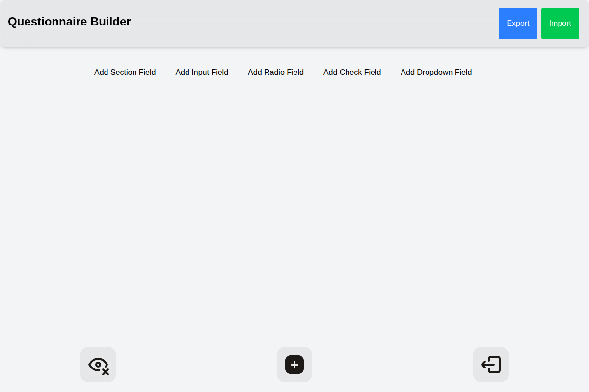

---

# 📝 Questionnaire Builder

🔗 [questionnnaire-demo](https://lattln-questionnaire-builder-main.opensource.mieweb.org/)

A modular, FHIR-compatible questionnaire builder built with **React**, **Tailwind CSS**, and **Framer Motion**.
Supports custom field types, conditional visibility with `enableWhen` logic, and exporting to the [FHIR Questionnaire](https://hl7.org/fhir/questionnaire.html) format.



---

## 🚀 Features

* Add, edit, and delete **5 field types**: text input, radio buttons, checkboxes, dropdown, and sections.
* Modular `fieldTypes` configuration for easy extension.
* Conditional field visibility via `enableWhen` logic.
* Mobile-friendly toolbar with preview mode toggle.
* JSON import/export.
* Export to **FHIR Questionnaire JSON**.

---

## 📦 Installation

```bash
# Clone the repository
git clone https://github.com/lattln/questionnaire-builder.git

cd questionnaire-builder

# Install dependencies
npm install

# Run the development server
npm run dev
```

---

## 📂 Project Structure

```
src/
  components/
    fields/
      basic_field/
        TextInput_Field.jsx       # Input Field component
        Radio_Field.jsx           # Radio Field component
        Check_Field.jsx           # Check Field component
        DropDown_Field.jsx        # Dropdown Field component
      adv_field/
        section_Field.jsx         # Section Field component
      fieldTypes-config.js        # Modular field type definitions
    EnableWhenLogic.jsx           # Conditional logic editor
    FormBuilderMain.jsx
    Header.jsx
    MobileToolBar.jsx
  utils/
    initializedFieldOptions.js
    visibilityChecker.js
  toFHIR.js                       # FHIR export logic
```

---

## 🎯 Question Types

The questionnaire builder supports multiple field types to create comprehensive forms. All field types can be used in both edit and preview modes.


### Input Field

A simple text input field for collecting short text responses.

**Use cases:** Name, email, address, short answers


**Configuration:**
- Question text
- Default answer (optional)
- Enable When logic for conditional visibility

### Radio Field

Single-choice selection from multiple options using radio buttons.

**Use cases:** Gender, rating scales, single preferences


**Configuration:**
- Question text
- Multiple options (can add/remove options)
- Enable When logic for conditional visibility

### Check Field (Checkbox)

Multiple-choice selection allowing users to select multiple options.

**Use cases:** Interests, symptoms, multi-select preferences


**Configuration:**
- Question text
- Multiple options (can add/remove options)
- Enable When logic for conditional visibility

### Dropdown Field

Single-choice selection from a dropdown menu to save space.

**Use cases:** Countries, states, categories with many options


**Configuration:**
- Question text
- Multiple options (can add/remove options)
- Enable When logic for conditional visibility

### Section Field

Organizational container to group related fields together.

**Use cases:** Grouping personal info, medical history, contact details

**Configuration:**
- Section title
- Can contain any combination of other field types
- Provides visual separation and organization

## ⚙️ Technical Configuration

The `fieldTypes-config.js` file defines all supported field types:

```js
const fieldTypes = {
  section: {
    label: "Section Field",
    component: SectionField,
    defaultProps: {
      fieldType: "section",
      title: "New section",
      fields: [],
    }
  },
  input: {
    label: "Input Field",
    component: InputField,
    defaultProps: { fieldType: "input", question: "", answer: "" },
  },
  radio: {
    label: "Radio Field",
    component: RadioField,
    defaultProps: {
      fieldType: "radio",
      question: "",
      options: ["", "", ""],
      selected: null,
    },
  },
  check: {
    label: "Check Field",
    component: CheckField,
    defaultProps: {
      fieldType: "check",
      question: "",
      options: ["", "", ""],
      selected: [],
    },
  },
  selection: {
    label: "Dropdown Field",
    component: SelectionField,
    defaultProps: {
      fieldType: "selection",
      question: "",
      options: ["", "", ""],
      selected: null,
    },
  }
}
```

Each field type has:

* **label** → Name displayed in the toolbar.
* **component** → React component used for rendering.
* **defaultProps** → Initial values when the field is added.

---

## 🛠 Adding Your Own Field Type
```
* Guide TBA
```
---
